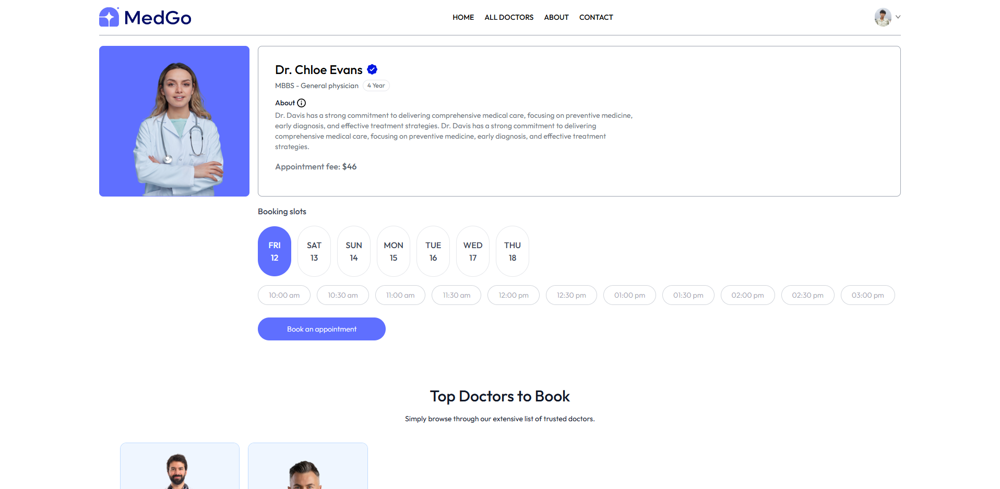
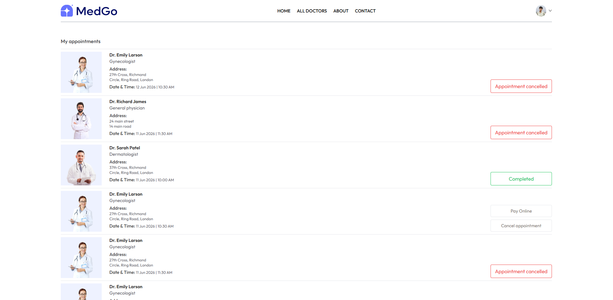
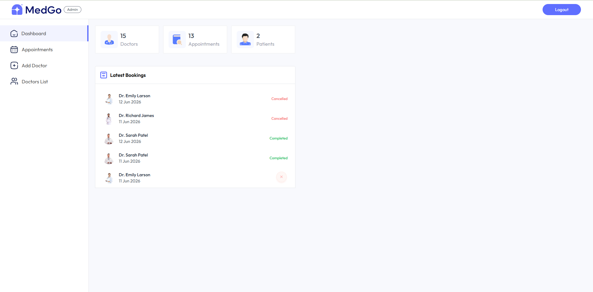
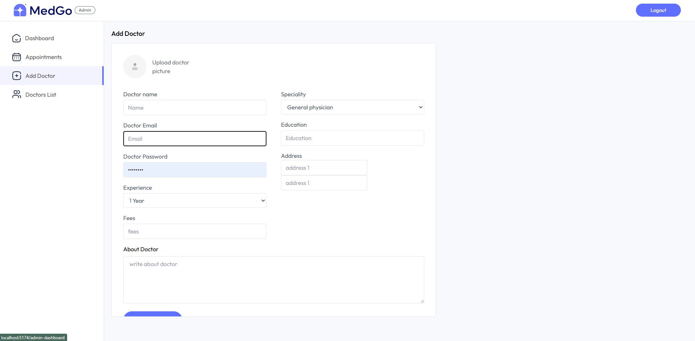

# MedGo

MedGo is a modern healthcare appointment booking platform built with a full-stack architecture.
It includes a polished patient-facing frontend, a dedicated admin panel for doctor management, and a secure Node.js/Express backend with MongoDB and Cloudinary integration.

---

## Project Overview

MedGo helps patients discover doctors by specialization, book appointments, manage appointments, and pay online.
Admins can add doctors, manage appointments, and track clinic performance through a clean, responsive dashboard.

Key modules:

- `frontend/` — patient portal built with React + Vite + Tailwind CSS
- `admin/` — admin/doctor dashboard built with React + Vite + Tailwind CSS
- `backend/` — Express.js API, MongoDB, authentication, Cloudinary and Razorpay support

---

## What Makes MedGo Great

- Patient registration and login
- Doctor listing by specialty
- Real-time slot booking with availability checks
- Appointment management and cancellation
- Online payment support using Razorpay
- Admin dashboard for doctor and appointment control
- Doctor dashboard for managing appointments and tracking earnings
- Cloudinary-powered doctor profile image uploads

---

## Features

### Patient Portal

- Browse doctors by specialization
- View doctor profiles, qualifications, experience, and fees
- Book available appointment slots with date/time selection
- Manage appointments with cancel and pay online options
- View appointment status: Paid, Cancelled, Completed
- Update user profile and picture

### Admin Dashboard

- Secure admin login
- Add new doctors with image upload
- View all registered doctors
- See appointment summaries and latest bookings
- Cancel appointments directly from the dashboard

### Doctor Dashboard

- Secure doctor login
- View doctor-specific appointments
- Mark appointments completed or cancelled
- Track total earnings, appointments, and patient count
- Update doctor profile and availability status

---

## Tech Stack

- Frontend: React, Vite, Tailwind CSS, React Router, React Toastify, Axios
- Backend: Node.js, Express, MongoDB, Mongoose, JWT, bcrypt
- Storage: Cloudinary
- Payment: Razorpay
- Image upload: Multer
- Environment: dotenv, CORS

---

## Repository Structure

- `frontend/` — Patient-facing website
- `admin/` — Admin and doctor portal
- `backend/` — REST API and database logic

---

## 🛠 Installation

### 1. Clone the repository

```bash
git clone <your-repo-url>
cd MedGo
```

### 2. Backend setup

```bash
cd backend
npm install
```

Create a `.env` file inside `backend/` with the following values:

```env
MONGODB_URI=<your-mongodb-connection-string>
JWT_SECRET=<your-jwt-secret>
CLOUDINARY_NAME=<cloudinary-cloud-name>
CLOUDINARY_API_KEY=<cloudinary-api-key>
CLOUDINARY_SECRET_KEY=<cloudinary-secret>
VITE_RAZORPAY_KEY_ID=<your-razorpay-key-id>
VITE_RAZORPAY_KEY_SECRET=<your-razorpay-key-secret>
```

### 3. Start the backend

```bash
npm run server
```

### 4. Frontend setup

```bash
cd ../frontend
npm install
npm run dev
```

### 5. Admin setup

```bash
cd ../admin
npm install
npm run dev
```

---

## 🔧 Available Scripts

### Backend

- `npm run start` — start server on default port
- `npm run server` — start backend with nodemon

### Frontend / Admin

- `npm run dev` — start dev server
- `npm run build` — create production build
- `npm run preview` — preview production build
- `npm run lint` — run ESLint

---

## Screenshots


- **Home Page**
  
- **Doctor Booking**
  
- **My Appointments & Payment**
  
- **Admin Dashboard**
  
- **Add Doctor**
  
- **All Appointments**
  
- **Doctor Dashboard**
  
- **Doctor Profile**
  

---

## Notes

- Backend connects to MongoDB at `${process.env.MONGODB_URI}/MedGo`
- Cloudinary image uploads require valid Cloudinary credentials
- Razorpay payment flow uses client-side key from `.env`
- Add a doctor from the admin dashboard before booking appointments in the patient portal

---

## Contribution

Feel free to improve MedGo by adding features such as:

- user password reset
- doctor appointment analytics
- email notifications
- search and sorting filters for doctors
- responsive mobile improvements
